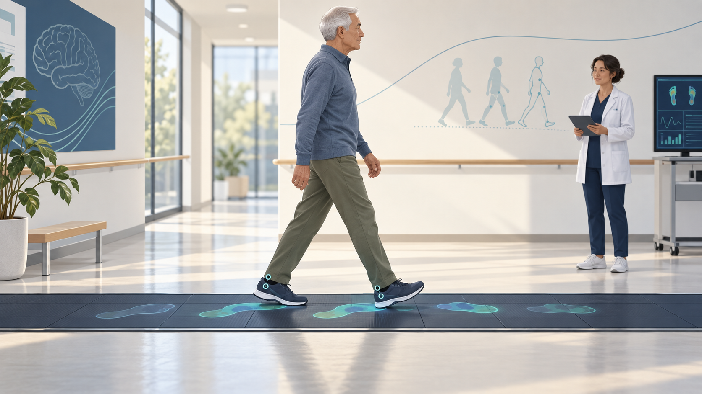
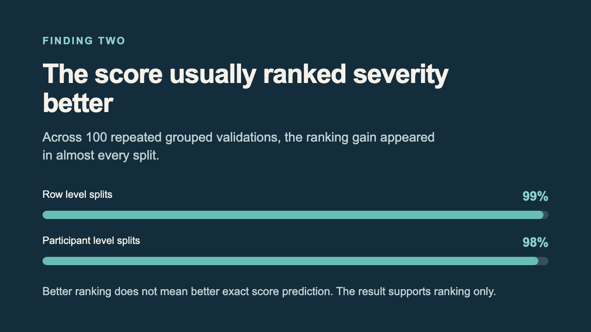

# Parkinsonian Gait Biomarkers



*This is an original illustration. It does not depict a study participant. No study data appear.*

This project asks a simple question. Do walking measurements tell us about Parkinsonian movement severity in more than one setting?

Walking measures change with the task. Pace, location, health, equipment all matter. A measure may look useful in one setting while failing in another. This research tests those differences directly.

## The short answer

In the main study, 62 people with Parkinson’s disease completed two walking tasks. No tested gait feature met the project’s full standard as a stable trait measure. A separate score did relate to severity. It improved the ordering of people by severity in nearly every repeated validation split. It did not reliably improve exact score predictions.

That is useful evidence. It is not proof of diagnosis. It is not proof of clinical benefit. Treatment response remains untested. The score is not ready to guide patient care.

## What the evidence says

The primary analysis included 124 task records from 62 people. Repeated records do not double the number of independent people. The preregistered trait standard was not met.

A score trained with healthy controls measured how much a person’s walking differed from the reference pattern. Its association with gait severity remained after speed adjustment. The standardized association was 0.301, with a 95 percent confidence interval from 0.089 to 0.513. The adjusted q value was 0.0055.

In 100 repeated validations, the score improved severity ranking in 99 percent of row level splits. This held in 98 percent of participant level splits. Exact score prediction did not improve consistently. The finding supports ranking only.

The project also rebuilt eight walkway measurements from raw WearGait records. All eight met the frozen comparison rule across 252 matched trials. The resulting score was evaluated across visits at least six months apart. Stability was below the project’s prespecified standard. These long intervals cannot measure short term repeatability. Health can change between visits. Medication state can change too.

The [latest scientific report](results/v4_5/AAN_v4_5_report.md) gives confidence limits, exclusions, source checks. It also explains the study limits. The [evidence table](results/v4_5/evidence_matrix.csv) gives the status of each claim.

## A few terms in plain language

A stable trait measure should give similar results when a person repeats the same task under similar conditions.

A confidence interval is a range that describes uncertainty around an estimate. The adjusted q value reflects correction across several measures. It helps limit false discoveries. It does not show the size of a clinical benefit.

Severity ranking means placing people in relative order by the study outcome. It does not mean predicting an exact clinical rating. Participant grouped validation keeps each person’s records together while checking how sensitive the result is to the people in each split.



## Why the result matters

A measure can track severity without being stable enough to monitor one person. A measure can rank people well without predicting an exact clinical score. Agreement between two measurement systems does not establish usefulness in a new clinic. These are separate scientific questions.

This project keeps those questions separate. It reports positive findings. It reports failed tests. It names questions the available data cannot answer. It does not change thresholds after seeing results.

## Start here

Use Python 3.11. From the project folder, run the setup script. It creates `.venv` when needed. It installs the pinned packages, then installs the project.

```bash
bash scripts/setup_environment.sh
source .venv/bin/activate
```

Run the complete automated test suite with `pytest`. The shorter Python unittest command misses tests.

Public metadata can be refreshed without downloading participant records.

```bash
python scripts/acquire_dataset_metadata.py
```

The main pipeline needs authorized source data. Keep that material outside this repository. Set `PARKINSON_GAIT_DATA_ROOT` to the parent folder that contains the authorized dataset folders. Its contents must include `WearGait_PD_V1`, `WearGait_PD_Longitudinal`, `CARE_PD`, `MobiliseD_CVS_v1_0_0`, `Mendeley_Gait_PD_v2`, as well as `AdaptiveDBS_Gait_2026`.

```bash
export PARKINSON_GAIT_DATA_ROOT="/path/to/authorized/Parkinsonian_Gait_Data"
bash scripts/reproduce_final_results.sh
```

The corrected v4.5 release has several ordered steps. Run the v4.3 walkway reconstruction check first. Then run the v4.4 measurement protocol. Next run the v4.5 score repair. Follow with the source audit, report creation, release gate. The [reproduction guide](docs/reproduction_guide.md) lists each command with its expected files.

Raw data plus person level outputs are not part of this public repository. Access depends on each dataset’s terms. Low disk space can stop a run. Credentials may expire. Files may be missing. A Drive placeholder may remain inaccessible. Such a run must be reported as incomplete. It must not be described as a failed scientific hypothesis.

The analysis freeze check needs the full Git history. A shallow clone may fail that check even when the source files are correct. Git tags identify source snapshots. GitHub Releases are separate published records. Check both before citing a release.

## What comes next

The next step should be better evidence, not a more complex model. Clinical measurements need visit links. Short interval repeat visits need a documented health state. An independent center needs a validated measurement bridge. Without these inputs, change over time remains untested. Wider use remains untested.

The FDA dataset description says sessions include links to clinical ratings. It also lists medication details. It also lists DBS information. The authorized files in this analysis did not verify repeated session level ratings. Ask the data custodians to confirm the release version, access rules, table names, link fields, plus assessment dates. Do not join records using participant ID alone.

Any future score comparison should use the same participant level splits. Use the same site splits too. Compare speed alone first. Then compare a small feature set chosen in advance. Evaluate the frozen deviation score separately. Report ranking, exact prediction error, calibration, missing data, plus confidence intervals. Use simulations to plan sample size. Keep this work separate from the frozen result.

The [dataset guide](DATASETS.md) explains what each source can answer. The [preregistered design](docs/preregistration.md) records the original tests. The [research review](research_review_parkinsonian_gait.md) explains the scientific background.

## Short video

The video explains the study question. It shows the ranking result, then explains the main limits. Its statistics come from the public aggregate report. It does not show participant data.

[Watch the short animated explanation](media/remotion/public/gait_study_overview.mp4). A [still image of the ranking result](docs/images/ranking_result.png) is also available.

Video source files are in `media/remotion`. Run `npm install` in that folder, then use `npm run render` to rebuild the video.
