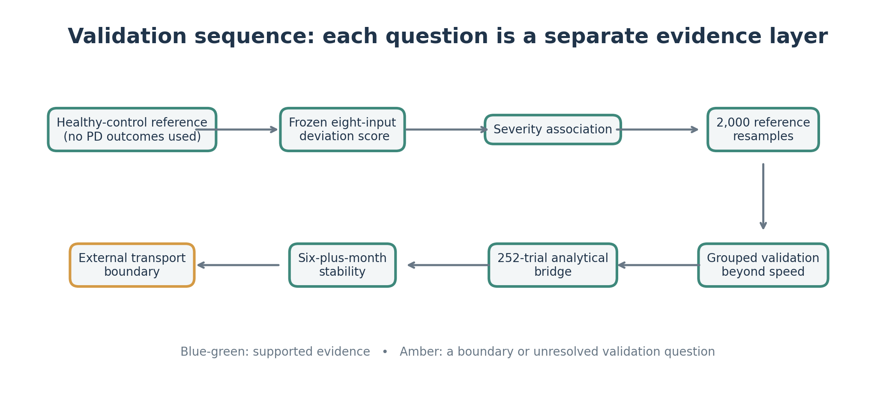
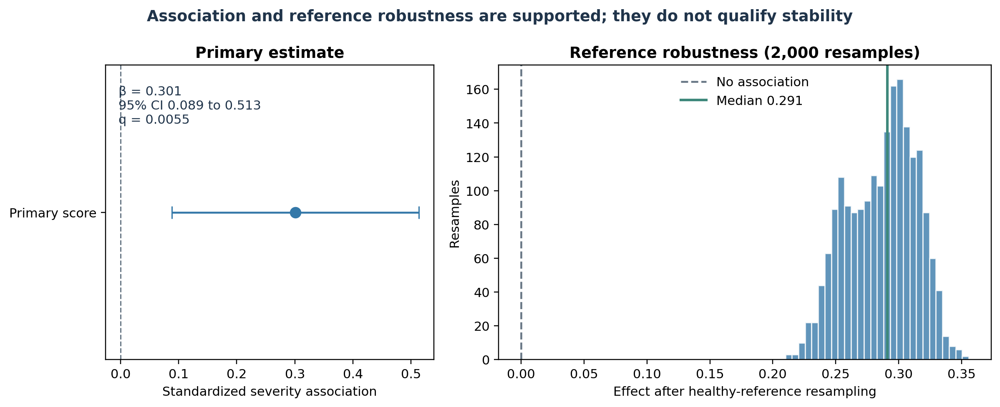
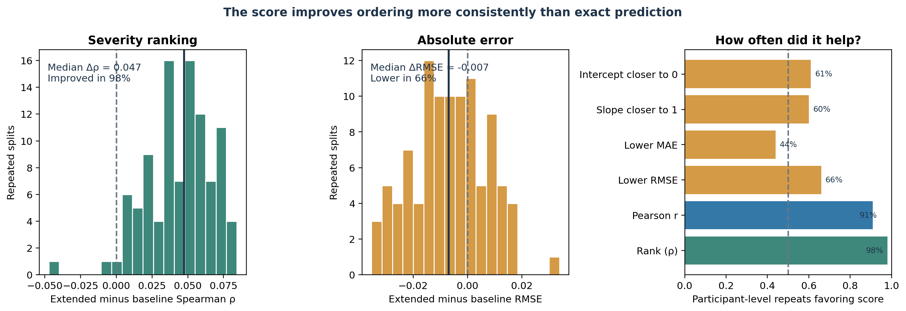
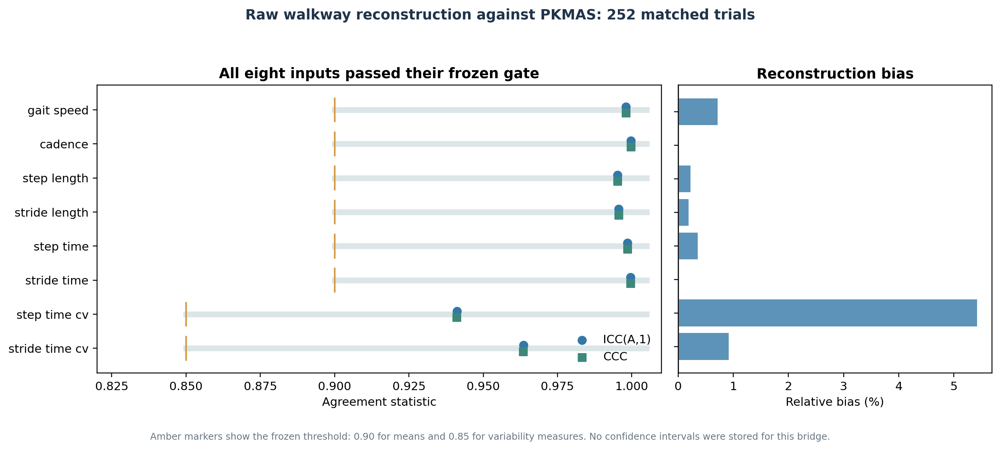
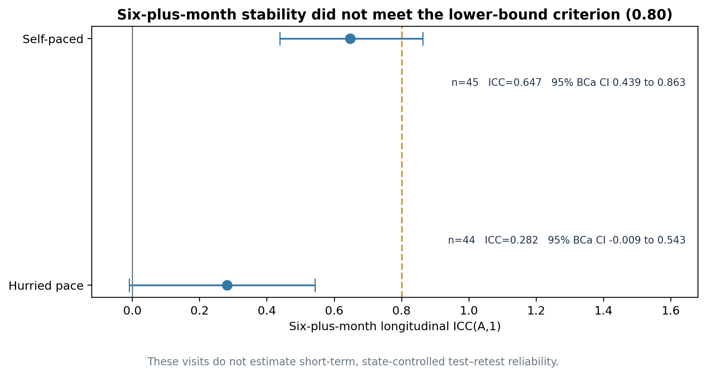
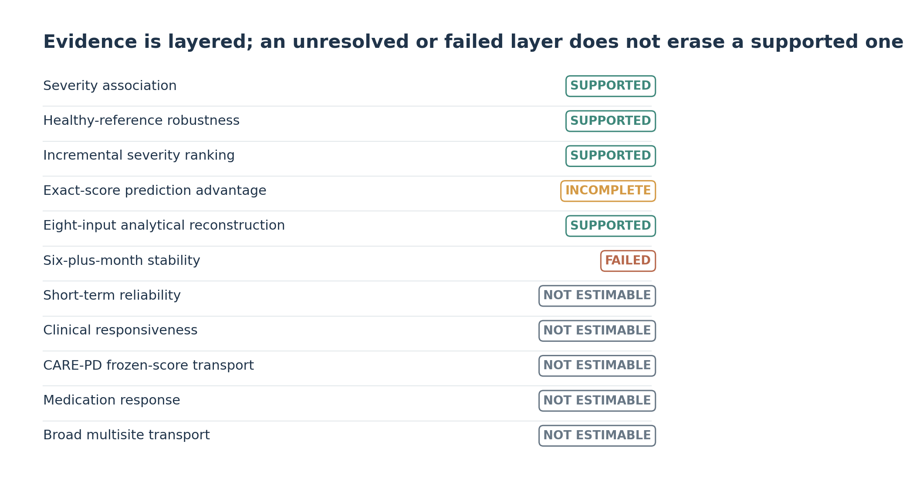

# When association is not validation

## Testing a control-referenced Parkinsonian gait measure

**Canonical AAN research report.** The latest scientific analyses are frozen at v4.5.1. This submission release organizes those results; it does not change the score, models, thresholds, or participant-level analyses. Earlier reports remain available for provenance in [Historical reports](HISTORICAL_REPORTS.md).

## Abstract

Background. A gait measure can correlate with Parkinsonian severity without being reliable, repeatable, or transferable enough to serve as a biomarker. We tested the evidence layers separately rather than treating association as qualification.

Objective. Determine whether an outcome-blind deviation from healthy gait provides severity information beyond walking speed, then evaluate it across distinct validation layers.

Methods. We analyzed the frozen WearGait-PD study of 62 people with Parkinson’s disease and 124 task observations. A healthy-control reference defined an eight-input gait-deviation score without using Parkinsonian outcomes. We estimated its association with gait-specific MDS-UPDRS severity using participant-clustered models, resampled the control reference 2,000 times, and compared speed-only and extended models in 100 repeated participant-grouped five-fold validations. Before longitudinal use, raw walkway reconstruction was compared with PKMAS on 252 matched trials. The unchanged score was then applied to visits separated by at least six months.

Results. The standardized severity association was 0.301 (95% CI, 0.089 to 0.513; q=0.0055). All 2,000 reference resamples retained the same direction, with median effect 0.291. At the participant level, the score improved rank correlation in 98% of repeated validations; median ΔSpearman was 0.047. The median RMSE change was −0.0069, but RMSE improved in only 66% of repeats and MAE in 44%, so better exact-score prediction was not established. All eight reconstructed inputs passed their frozen analytical-equivalence gates. Six-plus-month stability did not meet the prespecified criterion: SelfPace ICC(A,1)=0.647 (95% BCa CI, 0.439 to 0.863; n=45) and HurriedPace ICC(A,1)=0.282 (95% BCa CI, −0.009 to 0.543; n=44).

Conclusion. The score consistently improved severity ranking in repeated grouped validation and can be reconstructed from raw walkway records, but it did not meet the long-interval stability standard. Severity association and analytical validity do not guarantee longitudinal biomarker stability. Short-term reliability, clinical responsiveness, and broad external transport remain unestablished.

## The clinical problem

Parkinson’s disease affects movement through changes in the brain systems that initiate, scale, and automate action. Loss of dopaminergic input to the striatum alters basal-ganglia circuits; people may develop bradykinesia, reduced stride size, slower walking, and difficulty maintaining or adapting a walking pattern [3]. The clinical gait item in the MDS-UPDRS gives clinicians a structured way to rate one part of this motor phenotype [1].

Wearables and instrumented walkways can record many gait features. A feature that differs with a clinical rating may still be sensitive to walking speed, task instructions, site, device, or day-to-day state. It may also be difficult to measure consistently. These questions are distinct. Digital health measurement guidance separates technical verification, analytical validity, and clinical validation for this reason [2]. Parkinson gait reviews likewise describe substantial variation in sensors and protocols, and call for stronger evidence about clinical meaning and behavior outside a single laboratory visit [7, 13].

## Research question and hypothesis

**Question.** Does a gait-deviation score defined relative to healthy walking retain useful information about Parkinsonian gait severity, and what happens when the score is tested for robustness, added value, measurement agreement, longitudinal stability, and transport?

**Hypothesis.** We hypothesized that an outcome-blind gait-deviation score defined relative to healthy gait would retain an association with Parkinsonian gait severity beyond simple walking speed, but that association alone would not be sufficient for biomarker qualification. We therefore evaluated reference robustness, incremental severity information, analytical validity, longitudinal stability, and external transport as separate evidence layers.

The hypothesis was falsifiable. The score could fail a prespecified layer even if earlier layers were supported. No threshold was relaxed after results were observed.

## Study overview

The score’s healthy reference was fixed before using Parkinsonian outcomes. The v4.1 validation then tested the same score rather than selecting a new one. v4.3 established a raw-walkway measurement bridge before applying the score to repeated visits. v4.5 corrected the description of those visits: they were at least six months apart and therefore inform long-interval stability, not short-term repeatability.

## Data sources

The public repository contains metadata and aggregate results, not participant-level records. Each dataset answers a different question. Their measures are not interchangeable.

| Dataset | Project sample used | Measurement and labels | Role in this study |
|---|---|---|---|
| WearGait-PD V1 | 62 PD participants and 124 task observations in the conventional screen. The score association table records 125 modeled rows across the same 62 people. | Synchronized wearable sensors and pressure walkway with clinical and demographic information; healthy controls supplied the outcome-blind reference. | Primary severity association, reference-score development, and 252-trial analytical bridge. |
| WearGait-PD longitudinal | Source release describes a 47-person PD subset with visits at least six months apart. Four-pass score pairs included 45 SelfPace and 44 HurriedPace participants. | Repeated walkway and sensor measurements; verified repeated clinical anchors were not available in the audited release. | Six-plus-month stability under changing clinical conditions. |
| CARE-PD | The project’s four UPDRS-gait cohorts include 110 people and 2,953 labeled walks. | Anonymized SMPL motion from video or motion capture, with heterogeneous cohort-specific labels [10]. | Cohort-specific translation-speed checks only. It does not reproduce the frozen eight walkway inputs. |
| Mobilise-D CVS | Frozen project table: 574 participants and 2,079 repeated observations. | Real-world digital mobility measures and a broad motor anchor. | Separate within-person construct-level evidence for four pace and rhythm measures. |
| Mendeley gait | 42 cross-sectional observations; 10 participants in the six-month table; 20 people in repeated medication-timing rows. | Processed gait measures and source-specific gait ratings or medication timing. | Small exploratory transport and change summaries, not confirmatory inference. |

The CARE-PD source paper describes nine cohorts from eight clinical centers and reports 362 participants across the full release [10]. Its heterogeneous motion representation is valuable for cross-dataset work, but it is not a calibrated PKMAS walkway measurement system. The current study does not convert one representation into the other without an independently validated bridge.

## Initial screen of conventional gait measures

The first analysis asked whether familiar walkway features were associated with concurrent gait severity. It included 62 PD participants and 124 task observations, used participant-clustered models, adjusted for age, height, sex, task, and site where estimable, and corrected the declared families for multiple testing. Eight of eleven conventional measures showed an association after FDR correction.

None met the full prespecified standard for a context-robust trait measure. For example, step-time variability retained a speed-adjusted association but had a self-paced repeated-session ICC(A,1) of 0.141. A significant coefficient alone did not establish that a feature was independent of speed or stable enough to describe a person over time. The original report and tables remain available as historical analyses.

## The control-reference score

The candidate, named `context_adjusted_gait_deviation_v1`, uses eight frozen inputs: gait speed, cadence, mean step length, mean stride length, mean step time, mean stride time, step-time coefficient of variation, and stride-time coefficient of variation.

The reference model predicts the healthy-control mean for a person’s age and height. It estimates the covariance among the control residuals. For a measured feature vector \(x_i\), the score is the square root of its covariance-weighted distance from that expected control pattern:

\[
D_i = \sqrt{(x_i-\widehat{\mu}_{control}(age_i,height_i))^\mathsf{T}
\widehat{\Sigma}_{control}^{-1}
(x_i-\widehat{\mu}_{control}(age_i,height_i))}
\]

The score is outcome-blind: Parkinsonian severity was not used to fit the control reference, select its eight inputs, or tune its threshold. A larger value means a greater multivariate departure from the fitted control pattern. It is not a diagnosis and it does not state why a person’s gait differs.

## Primary severity association

In the frozen primary model, the standardized association between the score and concurrent gait-specific severity was 0.301 (95% CI, 0.089 to 0.513; q=0.0055). After adjustment for gait speed, the standardized association was 0.279 (95% CI, 0.083 to 0.475; q=0.0053). Both estimates use the frozen participant-clustered model with age, height, sex, task, and site terms where estimable.

The q-value belongs to the prespecified primary score test. It addresses multiplicity for that declared test; it does not measure clinical importance. The output records 125 score-model rows from 62 participants, while the preceding conventional-feature screen contains 124 task rows. The report keeps those denominators separate because they come from distinct frozen analysis tables.

## Healthy-reference robustness

The control reference was resampled 2,000 times while the score definition stayed fixed. The severity association retained its direction in all 2,000 resamples. The median standardized effect was 0.291. This makes it less likely that the association depends on a few people in the healthy reference sample. It does not count as replication in a new clinical cohort.

## Incremental information beyond speed

The score was compared with a speed-only baseline using repeated five-fold splits grouped by participant. The participant-level unit matters: both task records from one person stayed in the same fold. In 100 repeated validations, median ΔSpearman was +0.0474, and Spearman improved in 98% of repetitions. The row-level median ΔSpearman was +0.0545, positive in 99% of repetitions.

The absolute-prediction results were weaker. At the participant level, median ΔRMSE was −0.0069, but lower RMSE occurred in 66% of repetitions and lower MAE in 44%. Pearson correlation improved in 91%. Calibration slope was closer to its ideal of 1 in 60% of repeats, while intercept was closer to its ideal of 0 in 61%. These are favorable-repeat fractions, not separate significance tests. In a single grouped held-out comparison, Spearman rose from 0.310 to 0.386 while RMSE rose from 0.638 to 0.651. Regularized sensitivity preserved the ranking advantage but did not show consistent RMSE improvement.

| Participant-level measure | Repeats favoring extended model | Interpretation |
|---|---:|---|
| Spearman ranking | 98% | Strongest and most consistent gain |
| Pearson correlation | 91% | Correlation improved in most repeats |
| Lower RMSE | 66% | Modest, not consistent absolute-error gain |
| Lower MAE | 44% | Not a consistent gain |
| Calibration slope closer to 1 | 60% | Limited calibration evidence |
| Calibration intercept closer to 0 | 61% | Mixed calibration evidence |

The frozen interpretation is `RANKING_SUPPORT_ONLY`. The score consistently improved relative severity ordering beyond speed in the repeated grouped validations. Better exact-score prediction has not been established. Spearman correlation and prediction error answer different questions and are reported separately.

## Analytical measurement validation

Longitudinal scoring depended on reconstructing the same eight measurements from raw walkway data. The v4.3 procedure used the source’s documented 1.27 cm sensor-cell pitch and walkway axis. It identified foot-contact passages, computed active-cell centroids at contact frames, and evaluated the result against matched PKMAS trials. The extractor did not learn its coordinate transform from PKMAS values.

All eight features passed their frozen analytical-equivalence gates on 252 matched V1 trials. Mean features required ICC(A,1) and concordance correlation coefficient (CCC) of at least 0.90; variability features required at least 0.85. Bias also had to meet the declared limits. Five raw trials were excluded because there were not enough alternating contacts. No partial score was used.

| Reconstructed input | ICC(A,1) | CCC | Relative bias | Frozen gate |
|---|---:|---:|---:|---|
| Gait speed | 0.998 | 0.998 | 0.71% | PASS |
| Cadence | 1.000 | 1.000 | 0.01% | PASS |
| Step length | 0.995 | 0.995 | 0.22% | PASS |
| Stride length | 0.996 | 0.996 | 0.19% | PASS |
| Step time | 0.998 | 0.998 | 0.35% | PASS |
| Stride time | 1.000 | 1.000 | 0.01% | PASS |
| Step-time CV | 0.941 | 0.941 | 5.42% | PASS |
| Stride-time CV | 0.964 | 0.963 | 0.91% | PASS |

These values support agreement between the reconstructed features and PKMAS for this WearGait bridge. They do not establish clinical validity, responsiveness, or equivalence in CARE-PD or another device.

## Six-plus-month longitudinal stability

The source visits were separated by at least six months. The outcome is therefore long-interval stability under conditions where disease severity, health, or medication state may have changed. It cannot isolate short-term measurement repeatability.

The v4.5 correction used the unchanged score with a four-pass median endpoint. The prespecified criterion required the lower confidence bound for ICC(A,1) to reach 0.80. SelfPace had 45 paired participants and ICC 0.647 (95% BCa CI, 0.439 to 0.863). HurriedPace had 44 paired participants and ICC 0.282 (95% BCa CI, −0.009 to 0.543). Both lower bounds fell below 0.80, so six-plus-month stability is `FAILED`.

Short-term, state-controlled test-retest reliability is `NOT_ESTIMABLE`. Between-visit variation also includes real change and state effects; it is not pure measurement error. This finding does not show that the score is unreliable during repeated walks over a short, controlled interval.

## External validation and response boundaries

### CARE-PD

Four labeled CARE-PD cohorts showed negative cohort-specific forward-translation-speed estimates against gait severity: 3DGait −0.785 (n=43), BMCLab −0.688 (n=23), PD-GaM −0.748 (n=30), and T-SDU-PD −0.461 (n=14). These estimates are separate exploratory checks. They are not pooled, and they do not validate the frozen WearGait score.

The full eight-input CARE-PD score transport test is `NOT_ESTIMABLE` because analytical equivalence to all eight PKMAS inputs and the matching healthy reference has not been established. The medication-response analysis is also `NOT_ESTIMABLE`; medication labels alone do not provide a comparable score.

### One-site transport sensitivity

The VA Seattle holdout estimate was 0.578 (95% CI, 0.186 to 0.970) for one overlapping site with 16 target PD participants. The control reference came from another site. This is limited association evidence, not evidence that absolute score calibration transports across clinics. Broad multisite transport remains unresolved.

### Mobilise-D

In the frozen within-person analysis of 574 participants and 2,079 observations, walking speed and stride length tracked the source broad motor anchor after the four-feature FDR adjustment (q=0.0046 and q=0.0017). Cadence (q=0.544) and stride duration (q=0.674) did not pass. This supports two construct-level gait associations in that real-world dataset; it does not validate the WearGait control-reference score.

### Mendeley

The processed cross-sectional table showed associations for some features, including gait speed (Spearman rho −0.656) and stride amplitude (rho −0.617) among 42 observations. The longitudinal summary included ten people, and the repeated medication-timing table included 20 people. The frozen cross-sectional table has no bootstrap confidence intervals or FDR correction; the small change summaries are descriptive. These data are exploratory, not independent confirmatory evidence for the frozen score.

## Evidence ladder

| Evidence layer | Result | Meaning |
|---|---|---|
| Concurrent severity association | SUPPORTED | The frozen score was associated with concurrent gait-specific severity. |
| Healthy-reference robustness | SUPPORTED | Direction was retained in all 2,000 control-reference resamples. |
| Incremental severity ranking beyond speed | SUPPORTED | Ranking improved in 98% of participant-level repeated validations. |
| Better exact-score prediction | INCOMPLETE | Ranking improved more consistently than RMSE, MAE, or calibration. |
| Eight-input analytical reconstruction | SUPPORTED | All eight inputs passed the frozen WearGait PKMAS agreement gates. |
| Six-plus-month stability | FAILED | Both tasks missed the lower-confidence-bound criterion of 0.80. |
| Short-term test-retest reliability | NOT ESTIMABLE | The available visits were not short-interval, state-controlled repeats. |
| Clinical responsiveness | NOT ESTIMABLE | Repeated, session-linked clinical anchors were not verified. |
| CARE-PD frozen-score transport | NOT ESTIMABLE | An all-eight-input measurement bridge is absent. |
| General multisite transport | INCOMPLETE | One-site sensitivity cannot establish broad transport. |
| Medication response | NOT ESTIMABLE | Comparable repeated score and medication anchors are unavailable. |

## Interpretation and contribution

This study supports a specific conclusion. A control-referenced gait-deviation score showed a severity association, remained directionally stable when the healthy reference was resampled, improved participant-level severity ranking beyond speed in repeated held-out validation, and could be reconstructed from raw WearGait walkway data within prespecified agreement limits. The same frozen score did not meet the six-plus-month stability criterion.

The contribution is the validation design, not the invention of gait features or the first Parkinson gait score. It applies a constrained evidence ladder to a fixed control-referenced measure and treats association, measurement agreement, ranking, stability, response, and transport as separate properties. Prior work has examined incremental gait variables [4], sensor-to-reference agreement [5], short-interval sensor reliability [6], and large-scale real-world mobility outcomes [9]. This project connects those types of questions for one frozen score and reports the unresolved layers alongside the supported ones.

The neurological connection is direct but limited. Basal-ganglia dysfunction and impaired movement scaling provide a rationale for measuring pace and step size [3]. The study’s clinical anchor is the gait-specific MDS-UPDRS item, not a neural measurement or causal test [1]. No result here shows that a particular neural circuit caused an individual’s score.

## Limitations

The main severity analysis has 62 independent PD participants. The outcome is a gait-specific clinical rating, not total disease burden. The longitudinal visits are separated by at least six months, so stability combines measurement variation with possible progression and state change. The one-site VA Seattle sensitivity does not establish general multisite transport. CARE-PD and Mendeley use different measurement representations and do not provide a validated bridge to every frozen input. The Mobilise-D anchor is broader motor severity, not the same gait-specific outcome.

This is not a causal study. It did not test a diagnostic threshold, clinical decision, treatment effect, or patient benefit. No evidence establishes clinical utility. Statistical significance and better ranking are not substitutes for those tests.

## Next experiments

1. Measure short-interval repeatability with the same task and device while documenting clinical state, health changes, and medication timing.
2. Record MDS-UPDRS gait ratings at every gait session so change in the score can be compared with change in a matched clinical anchor.
3. Validate the frozen measurement bridge in an independent center before evaluating the frozen score there.
4. Test a prespecified leave-center-out score without refitting on target-site outcomes.
5. Confirm the ranking result prospectively in an independent cohort, with participant grouping and ranking, absolute error, and calibration reported separately.

## Conclusion

The score retains severity-ranking information and has an analytically validated WearGait reconstruction, yet its six-plus-month stability did not meet the frozen criterion. The result demonstrates why a statistically convincing gait signal is not enough: measurement validity, robustness, longitudinal behavior, and transport must be tested on their own.

## Reproducibility and submission files

All figures in this report are generated from committed aggregate output tables. No participant identifiers, row-level predictions, or raw recordings are included. The report values are checked by the AAN submission QA command and traced to the frozen output paths in [AAN_submission_values.json](AAN_submission_values.json). The canonical structured claim table is [AAN_FINAL_EVIDENCE_MATRIX.csv](AAN_FINAL_EVIDENCE_MATRIX.csv), and sources are listed in [AAN_bibliography.md](AAN_bibliography.md).

The release uses frozen scientific results through v4.5.1. The submission version changes presentation and reproducibility checks only. See [authorship and assistance](AUTHORSHIP_AND_ASSISTANCE.md) before using any prose in an application.
