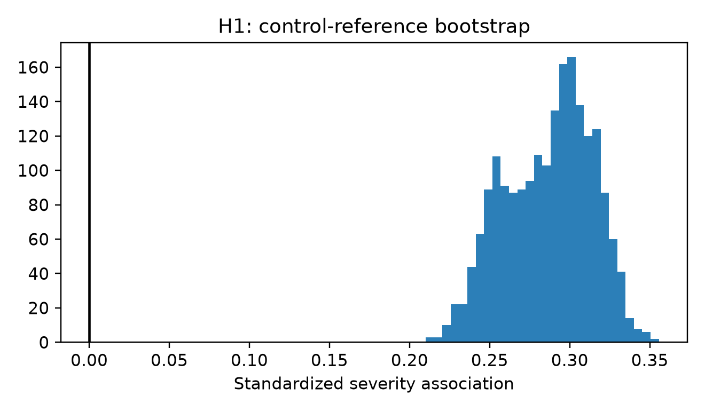
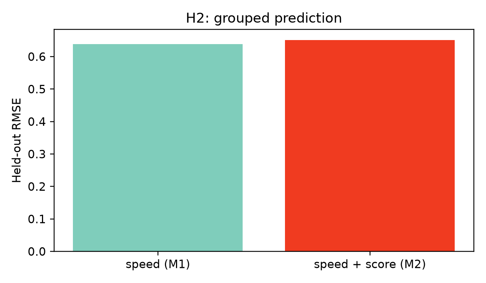
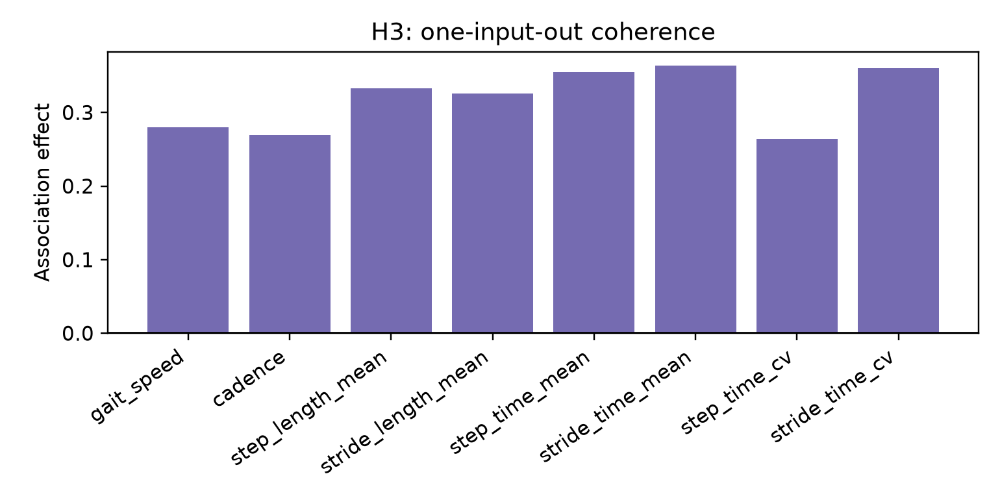
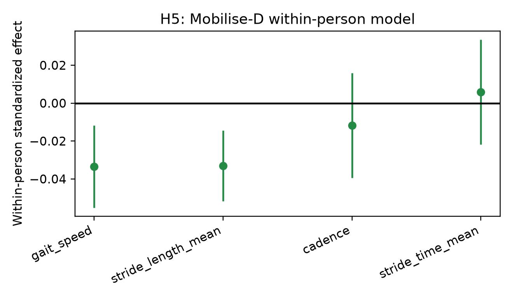
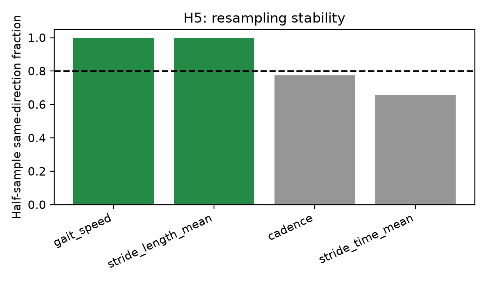

# AAN v4.1: Validation without feature fishing

## Abstract

Background: v4.0.6 identified an outcome-blind, eight-input control-reference gait-deviation score associated with Parkinsonian gait severity. Methods: We prespecified control-only 2,000-resample robustness, grouped held-out linear prediction, eight leave-one-input-out analyses, repeated-session equivalence auditing, and a four-feature Mobilise-D within/between model with 200 participant-half resamples. Results: The score’s association was 0.301; all reference resamples retained its direction (median 0.291). Adding the score to speed increased held-out rank correlation (0.310 to 0.386) but did not improve RMSE (0.638 to 0.651). Mobilise-D within-person effects were stable for speed and stride length, while cadence and stride duration were inconclusive. Longitudinal eight-input repeatability and external transport remain not estimable. Conclusion: The score is reference-robust and independently associated, but this sample does not establish incremental predictive improvement, repeatability, or transport; it remains a promising, not qualified, trait biomarker.

## Frozen results

- H1 reference robustness: **PASS**; same-direction fraction 1.000.
- H2 held-out comparison: Model 2 versus Model 1: delta MAE CI (-0.037932792895552826, 0.05458609542824439), delta RMSE CI (-0.05936149326219977, 0.12848393035730293), delta Spearman rho CI (-0.0060908357056058075, 0.16810091730253598). RMSE did not improve, so incremental predictive value is not supported in this sample.
- H3: all eight frozen single-input ablations are presented; none replaces the original score.
- H4: `NOT_ESTIMABLE`; the authorized longitudinal release cannot reconstruct all eight PKMAS-equivalent inputs. The serialized model round-trip difference was 0.0 (tolerance <=1e-10); no model was refit.
- H5: speed and stride length passed the prespecified 0.80 same-direction stability criterion; cadence and stride duration remain incomplete.
- External eight-input transport: `NOT_ESTIMABLE`; no improvised crosswalk was created.

## Interpretation

The validation strengthens robustness of the original association while narrowing its claim. Association and reference stability are not sufficient for a qualified trait biomarker: repeated-session reliability and external transport remain unresolved.

## Figures

