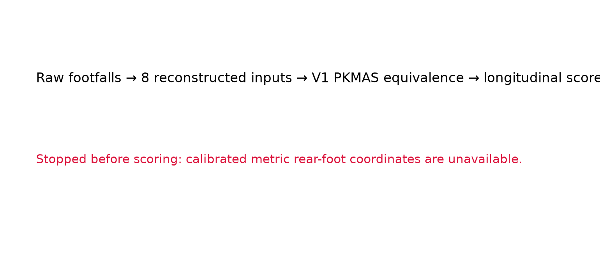
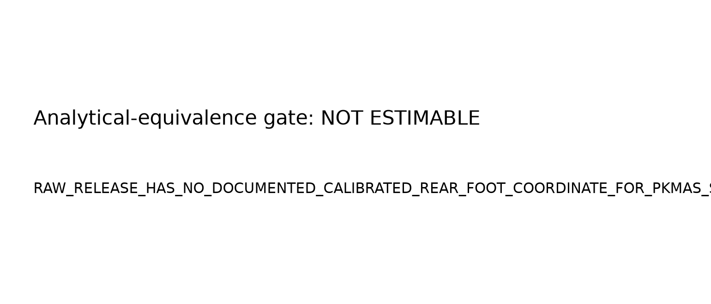
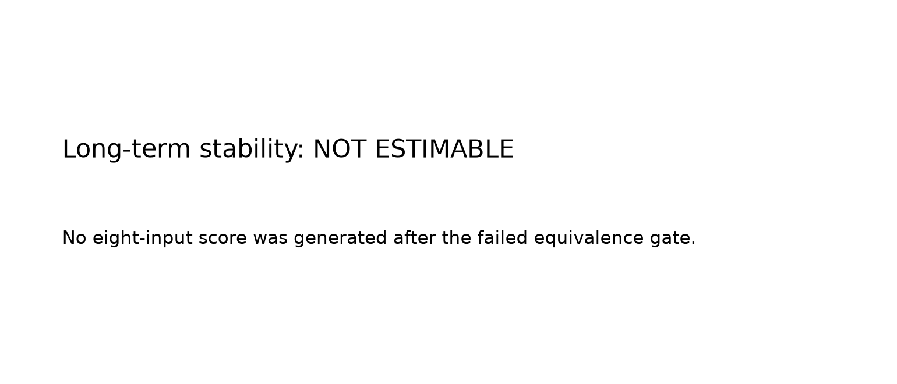
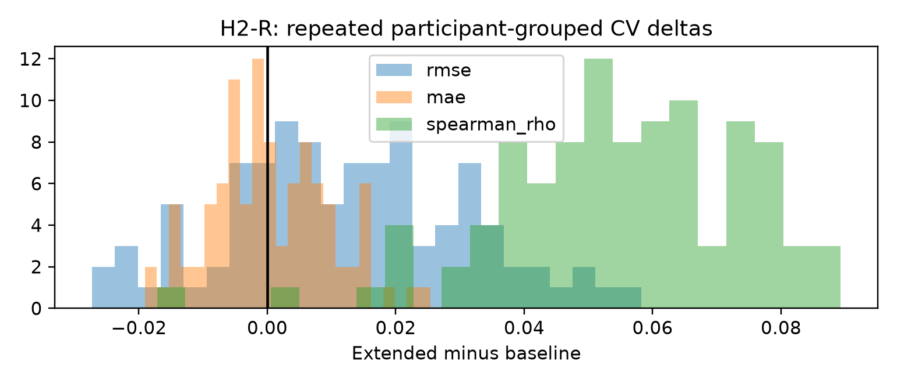

# AAN v4.2: H4/H2 validation closure

## Abstract

v4.2 prospectively tested two unresolved v4.1 questions without changing the frozen score or predictors. Raw WearGait walkway CSVs contain contact streams and pressure-grid strings, but lack a documented calibration from those grid strings to a metric rear-foot coordinate. Consequently, the required V1 PKMAS analytical-equivalence bridge could not be established for all eight inputs, and no longitudinal normative score was generated. H4 therefore remains `NOT_ESTIMABLE`, rather than being replaced by a partial or inferred score. For H2-R, 100 participant-grouped five-fold repetitions characterized the unchanged baseline and extended models. The median extended-minus-baseline Spearman delta was 0.0545; the median RMSE delta was 0.0123. The final H2-R label is `RANKING_SUPPORT_ONLY`. This supports only the stated ranking interpretation when applicable; it does not alter the original v4.1 conclusion that incremental absolute-score prediction beyond gait speed was not established.

## Interpretation

The failure to recover H4 is a data-provenance result, not a negative biomarker finding. The spatial inputs must remain unavailable until a documented metric-coordinate mapping is released. H2 robustness is limited to its predeclared model families.

