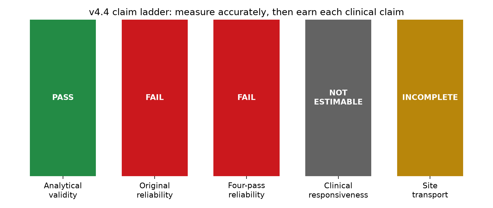

# AAN v4.4 measurement-error and responsiveness extension

## Bottom line

v4.4 makes the project more defensible by testing the proposed protocol rescue without changing the frozen v4.1 score, model, or v4.3 result. The four-pass, featurewise-median endpoint was estimable but did not meet the preregistered lower-95%-CI reliability criterion of 0.80. This is evidence against the proposed rescue under this protocol, not a reason to relax the criterion.

## New H4b protocol result

| Task | Paired participants | ICC(A,1) | 95% bootstrap CI | MDC95 | Status |
| --- | ---: | ---: | --- | ---: | --- |
| HurriedPace | 44 | 0.282 | -0.001 to 0.547 | 1.946 | `FAIL` |
| SelfPace | 45 | 0.647 | 0.331 to 0.819 | 1.928 | `FAIL` |

The score's analytical reconstruction remains validated. Its single-score and four-pass session-aggregate reliability are separate claims, and neither endpoint qualifies as a stable trait biomarker under the frozen 0.80 lower-bound rule.

## Claim ladder

| Claim | Status | Evidence |
| --- | --- | --- |
| V4.3 raw-to-PKMAS analytical bridge | `PASS` | All eight V1 inputs passed locked analytical-equivalence gates on 252 matched trials. |
| V4.3 frozen single-score test-retest reliability | `FAIL` | Self-paced ICC(A,1)=0.707 (CI 0.462 to 0.844); hurried ICC(A,1)=0.390 (CI 0.073 to 0.657). |
| V4.4 four-pass median protocol reliability | `FAIL` | HurriedPace: ICC(A,1)=0.282, 95% CI -0.001 to 0.547; MDC95=1.946. |
| V4.4 four-pass median protocol reliability | `FAIL` | SelfPace: ICC(A,1)=0.647, 95% CI 0.331 to 0.819; MDC95=1.928. |
| v4.4 overlapping-site transport sensitivity | `INCOMPLETE` | VA_Seattle: effect=0.578, 95% CI 0.186 to 0.970; ONE_OVERLAPPING_SITE_ONLY; CONTROL_REFERENCE_DERIVED_FROM_OTHER_SITE; NO_OUTCOME_TUNING; NOT_SUFFICIENT_FOR_GENERAL_TRANSPORT_CLAIM |
| clinical responsiveness | `NOT_ESTIMABLE` | NO_REPEATED_CLINICAL_OR_MEDICATION_FIELDS_IN_LONGITUDINAL_WALKWAY_CSVS |

## What this does and does not establish

The project now documents analytical validity, single-score reliability, a prespecified multi-pass protocol attempt, absolute measurement error, and the precise authorized-data boundaries for site transport and clinical responsiveness. It does not claim diagnostic performance, treatment response, causal change, or clinical utility. Repeated MDS-UPDRS Part III and medication-timing data linked to each longitudinal gait session are required before responsiveness or an anchor-based clinically meaningful change can be estimated.
